# Conception Merise de la plateforme GFP

*Ministère de la Fonction Publique et de la Modernisation de l’Administration — Côte d’Ivoire*

Ce document décrit la plateforme avec la méthode Merise : modèles conceptuels des données (MCD), des traitements (MCT) et organisationnel des traitements (MOT). Les schémas sont en Mermaid : GitHub les affiche directement.

Version PDF : [Conception_Merise_GFP.pdf](Conception_Merise_GFP.pdf)

## Lire les schémas

**MCD — Modèle Conceptuel des Données.** Décrit les informations manipulées : les entités (rectangles verts, identifiant souligné), les associations qui les relient (ovales orange, avec leurs propres attributs) et les cardinalités. Une cardinalité « 0,n » se lit : une occurrence de l’entité peut participer de zéro à plusieurs fois à l’association ; « 1,1 » : exactement une fois.

**MCT — Modèle Conceptuel des Traitements.** Décrit ce que fait le système, sans dire qui ni où : des événements (ovales orange) déclenchent des opérations (rectangles verts, avec leurs règles de gestion) qui produisent des résultats (hexagones gris, rouges pour un refus ou un rejet). Les branches portent la condition d’émission du résultat.

**MOT — Modèle Organisationnel des Traitements.** Précise qui fait quoi : chaque opération du MCT est affectée à un poste de travail (couloir) avec sa nature (manuelle, interactive ou automatique), sa durée et ses règles. Le schéma en couloirs donne les échanges entre les postes ; le tableau donne le détail de chaque opération.

## 1. Modèles conceptuels des données (MCD)

### MCD 1 — Organisation, comptes et droits

Un agent appartient à au plus une structure (Direction Générale, Direction, Sous-Direction…) et occupe au plus une fonction. Une structure peut dépendre d’une autre (hiérarchie du ministère) et avoir un agent responsable : c’est lui qui donne le visa sur les permissions de ses agents. Un agent peut avoir un compte utilisateur ; un compte porte un ou plusieurs rôles ; chaque rôle ouvre des privilèges.

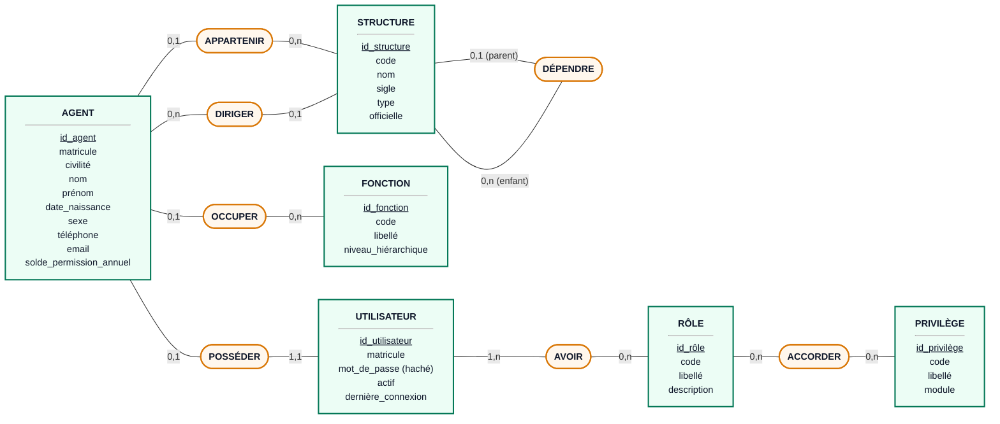

### MCD 2 — Demandes de permission

Une demande est déposée par un agent, relève d’un type de permission et porte un justificatif. Trois agents interviennent sur elle à titre différent : le gestionnaire RH (vérification et notification), le responsable de structure Sous-Directeur ou Directeur (visa, uniquement si la durée est de 2 jours ou moins) et le DRH (décision finale). Chaque changement d’état est conservé dans l’historique, et l’agent est alerté par une notification.

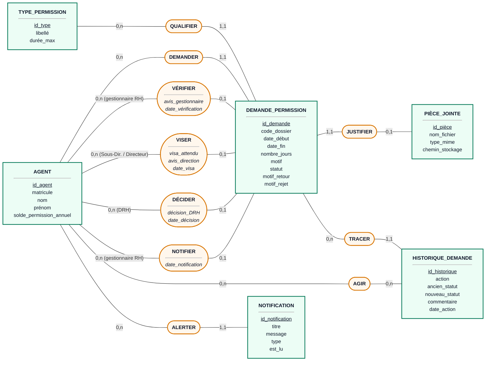

### MCD 3 — Déclarations de naissance et de décès

Les deux déclarations ont la même structure et le même circuit ; elles diffèrent par leurs informations propres et par la pièce obligatoire (extrait d’acte de naissance ou certificat de décès). L’agent déclare, le gestionnaire RH contrôle les pièces, le DRH valide ou rejette avec un motif. Chaque étape est tracée dans l’historique.

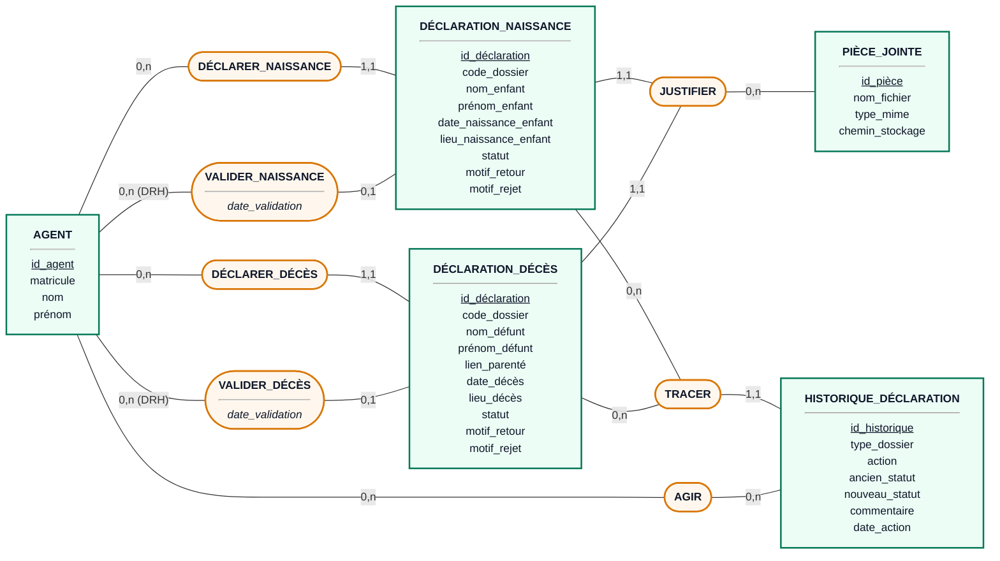

### MCD 4 — Notes de service

Une note est émise par une autorité (DRH, Directeur de Cabinet, Directeur ou Sous-Directeur), saisie par la secrétaire, éventuellement validée par l’autorité, puis destinée à une ou plusieurs structures. Ses destinataires sont les Directeurs, Sous-Directeurs, Chefs de service et agents de ces structures ; ils sont alertés par notification et par email.

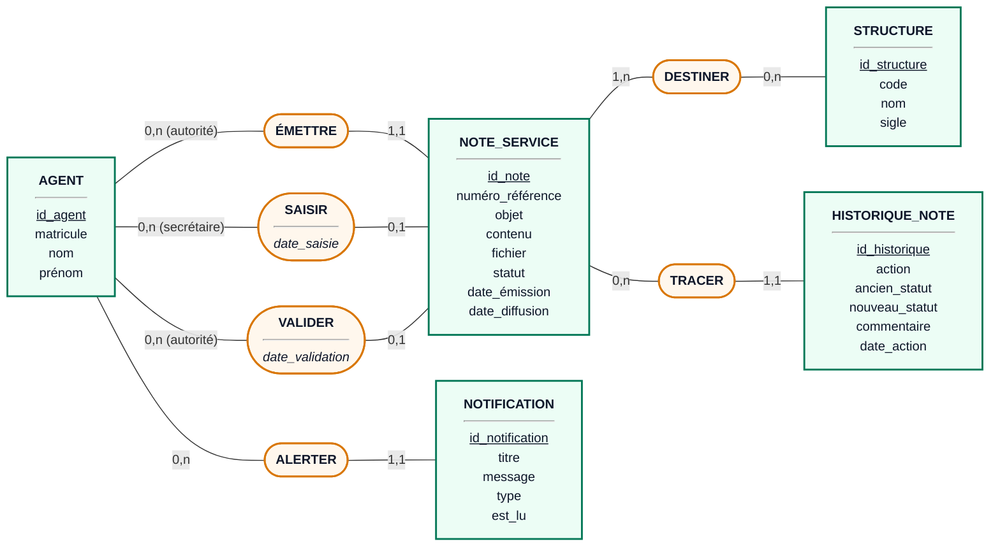

## 2. Modèles conceptuels des traitements (MCT)

### MCT — Demande de permission (1/2) — dépôt et vérification

Un seul circuit pour toutes les demandes. Le gestionnaire RH vérifie le dossier ; selon la durée, il le transmet pour visa (2 jours ou moins) ou directement au DRH (plus de 2 jours). Il peut aussi le retourner pour correction ou le rejeter.

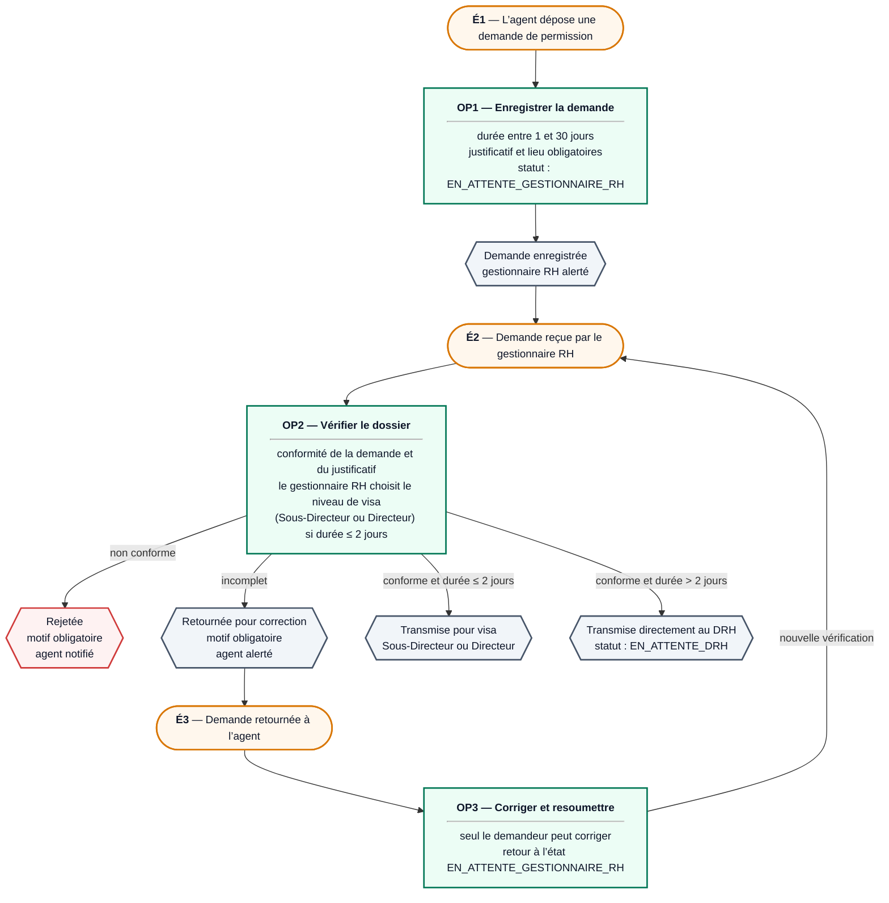

### MCT — Demande de permission (2/2) — visa, décision et notification

L’étape de visa n’existe que pour les demandes de 2 jours ou moins : un refus de visa clôt la demande et prévient le gestionnaire RH. Dans tous les cas, le DRH tranche, puis le gestionnaire RH notifie l’agent. Chaque opération est aussi enregistrée dans l’historique du dossier et dans le journal d’audit.

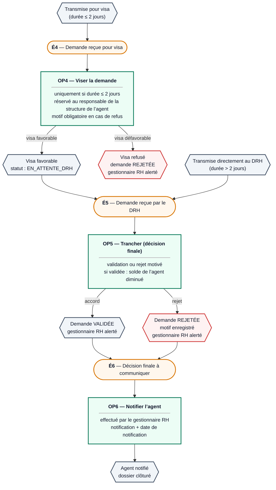

### MCT — Déclaration de naissance ou de décès (1/2) — dépôt et contrôle

Un seul circuit pour les deux types. L’agent déclare et joint la pièce officielle ; le gestionnaire RH contrôle. Il ne rejette pas : il retourne le dossier pour correction ou le transmet au DRH.

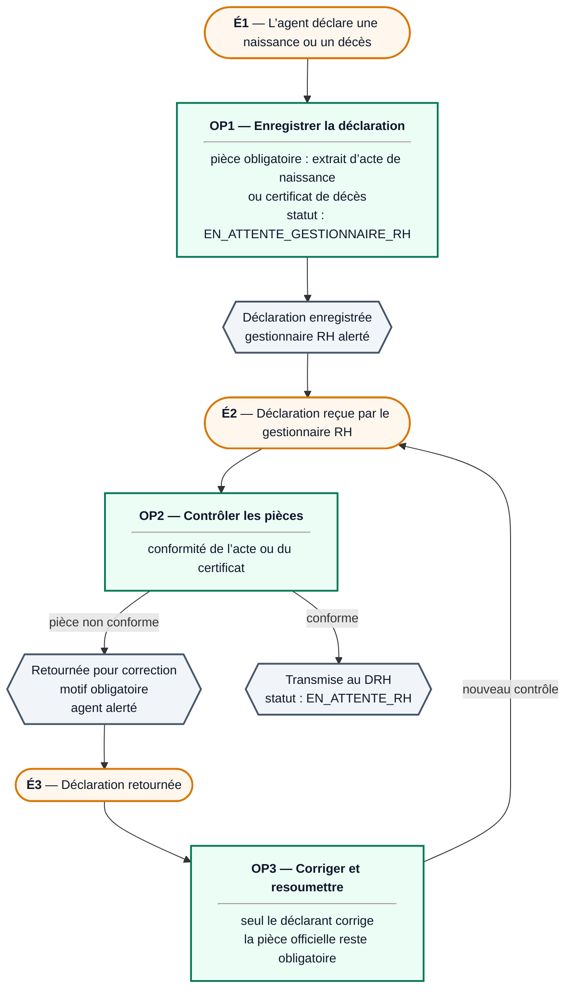

### MCT — Déclaration de naissance ou de décès (2/2) — décision et archivage

Le DRH valide ou rejette avec un motif, l’agent est notifié, puis le dossier est archivé.

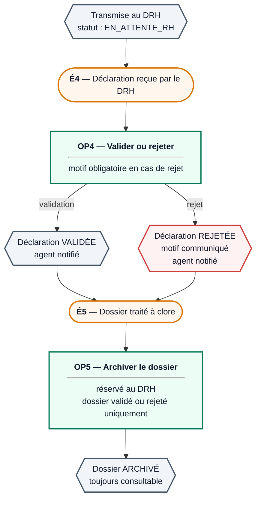

### MCT — Note de service (1/2) — émission et saisie

L’autorité émet la note et la transmet à sa secrétaire, qui la saisit et la met en forme.

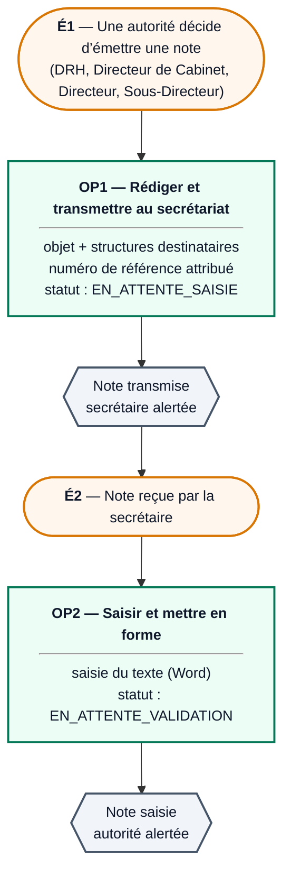

### MCT — Note de service (2/2) — validation, diffusion et archivage

La validation par l’autorité est possible avant la diffusion ; un refus clôt la note. La secrétaire diffuse par email et notification. Le Chef de service ne fait aucune demande : il reçoit seulement les notes diffusées.

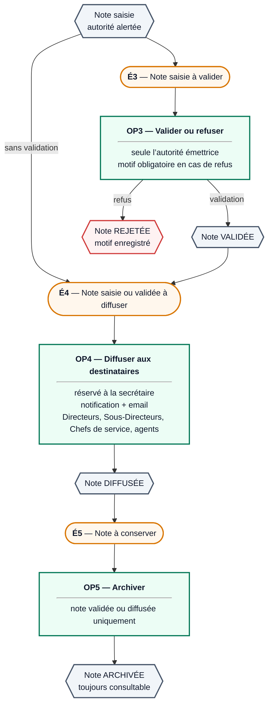

## 3. Modèles organisationnels des traitements (MOT)

### MOT — Demande de permission

Postes : Agent, Gestionnaire RH, Sous-Directeur ou Directeur (seulement pour les demandes de 2 jours ou moins), DRH.

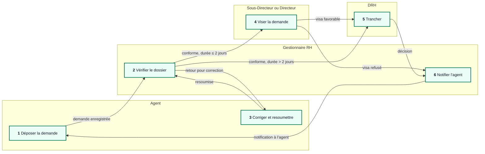

| N° | Opération | Poste | Nature | Durée | Règles de gestion | Résultat |
|---|---|---|---|---|---|---|
| 1 | Déposer la demande | Agent | Interactif | Immédiate | Durée de 1 à 30 jours ; justificatif et lieu obligatoires | Demande EN_ATTENTE_GESTIONNAIRE_RH |
| 2 | Vérifier le dossier | Gestionnaire RH | Manuel puis interactif | Sous 1 jour ouvré | Conforme, incomplet ou non conforme ; motif obligatoire si incomplet ou non conforme ; si durée ≤ 2 jours, choix du niveau de visa | Transmise pour visa (≤ 2 jours) ou au DRH (> 2 jours), retournée ou rejetée |
| 3 | Corriger et resoumettre | Agent | Interactif | Sous 2 jours | Seul le demandeur ; seulement si la demande est retournée | Retour à l’étape 2 |
| 4 | Viser la demande | Sous-Directeur ou Directeur | Manuel puis interactif | Sous 1 jour ouvré | Uniquement si durée ≤ 2 jours ; réservé au responsable de la structure de l’agent ; motif obligatoire si refus | EN_ATTENTE_DRH ou REJETÉE |
| 5 | Trancher | DRH | Manuel puis interactif | Sous 2 jours ouvrés | Motif obligatoire si rejet ; solde diminué si validée | VALIDÉE ou REJETÉE, gestionnaire RH alerté |
| 6 | Notifier l’agent | Gestionnaire RH | Interactif | Immédiate | Décision finale et agent non encore notifié | Agent notifié, dossier clôturé |

### MOT — Déclaration de naissance ou de décès

Postes : Agent, Gestionnaire RH, DRH.

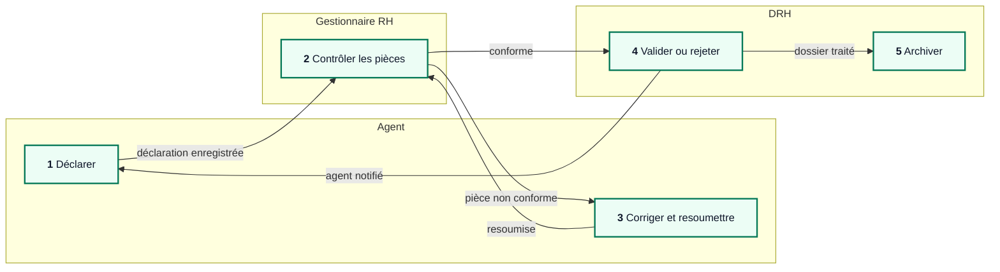

| N° | Opération | Poste | Nature | Durée | Règles de gestion | Résultat |
|---|---|---|---|---|---|---|
| 1 | Déclarer | Agent | Interactif | Immédiate | Pièce officielle obligatoire | EN_ATTENTE_GESTIONNAIRE_RH |
| 2 | Contrôler les pièces | Gestionnaire RH | Manuel puis interactif | Sous 1 jour ouvré | Motif obligatoire si retour | EN_ATTENTE_RH ou RETOUR_CORRECTION |
| 3 | Corriger et resoumettre | Agent | Interactif | Sous 2 jours | Seul le déclarant ; pièce toujours obligatoire | Retour à l’étape 2 |
| 4 | Valider ou rejeter | DRH | Manuel puis interactif | Sous 2 jours ouvrés | Motif obligatoire si rejet | VALIDÉE ou REJETÉE, agent notifié |
| 5 | Archiver | DRH | Interactif | Immédiate | Dossier validé ou rejeté uniquement | ARCHIVÉE |

### MOT — Note de service

Postes : autorité émettrice (DRH, Directeur de Cabinet, Directeur ou Sous-Directeur), secrétaire, destinataires (Directeurs, Sous-Directeurs, Chefs de service, agents).

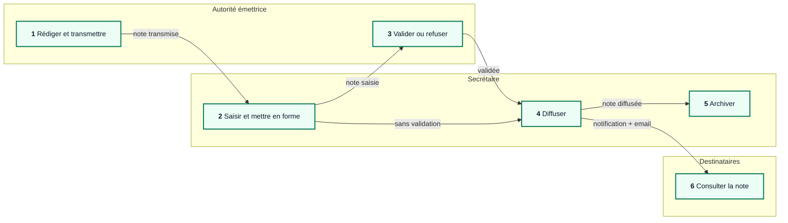

| N° | Opération | Poste | Nature | Durée | Règles de gestion | Résultat |
|---|---|---|---|---|---|---|
| 1 | Rédiger et transmettre | Autorité émettrice | Interactif | Immédiate | Objet et structures destinataires obligatoires | EN_ATTENTE_SAISIE, secrétaire alertée |
| 2 | Saisir et mettre en forme | Secrétaire | Manuel (traitement de texte) | Sous 1 jour | Seulement une note en attente de saisie | EN_ATTENTE_VALIDATION |
| 3 | Valider ou refuser | Autorité émettrice | Interactif | Sous 1 jour | Seule l’autorité émettrice ; motif obligatoire si refus | VALIDÉE ou REJETÉE |
| 4 | Diffuser | Secrétaire | Interactif puis automatique (email) | Immédiate | Note saisie et non refusée | DIFFUSÉE, notifications et emails envoyés |
| 5 | Archiver | Secrétaire ou autorité | Interactif | Immédiate | Note validée ou diffusée | ARCHIVÉE |
| 6 | Consulter la note | Destinataires | Interactif | Libre | Structure concernée ; le Chef de service ne fait aucune demande | Note lue |
